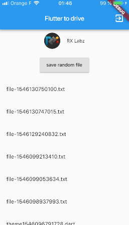

# flutter_to_drive

- https://pub.dartlang.org/packages/google_sign_in
- https://pub.dartlang.org/packages/googleapis

## Google auth

### [x] iOS

1. Create a [Firebase project](https://firebase.google.com)
2. Add an iOS application
3. Download the GoogleService-info.plist and add it to your xcode project /Runner
4. In the info.plist, line 36, add the REVERSED_CLIENT_ID ( from GoogleService-info.plist )  
5. Run 

### [x] Android

1. Create a [Firebase project](https://firebase.google.com)
2. Add an Android application
3. Enable OAuth for Drive API => https://console.developers.google.com/
4. Run 

## Getting Started

## Getting Started

This project is a starting point for a Flutter application.

A few resources to get you started if this is your first Flutter project:

- [Lab: Write your first Flutter app](https://flutter.io/docs/get-started/codelab)
- [Cookbook: Useful Flutter samples](https://flutter.io/docs/cookbook)

For help getting started with Flutter, view our 
[online documentation](https://flutter.io/docs), which offers tutorials, 
samples, guidance on mobile development, and a full API reference.
